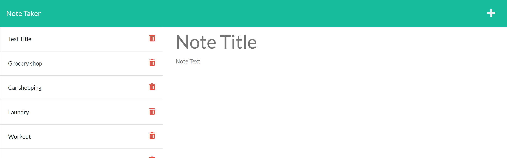

# Note Taker

### Project Description: Node app to record and save notes
### Project URL: [https://ancient-reaches-73596.herokuapp.com/](https://ancient-reaches-73596.herokuapp.com/)
### License Badge: N/A
## Table of Contents
1. [Technologies Used](#technologies-used)
2. [Installation and Requirements](#installation-and-requirements)
    1. [Prerequisites](#prerequisites)
    2. [How to Install](#installation-instructions)
3. [Usage](#usage)
4. [Contributions](#contributions)
5. [License](#license)
6. [Questions and Contact](#questions-and-contact)

## Technologies Used
node.js, express, JavaScript, HTML5

## Installation and Requirements
### Prerequisites
None

### Installation Instructions
n/a

## Usage

## Contributions
This project is not open to outside contributions at this time.

## License
N/A

## Questions and Contact
If you have questions regarding this project, contact Eric Duwe at ericduwe@gmail.com, or find me on [github](https://www.github.com/ericduwe).